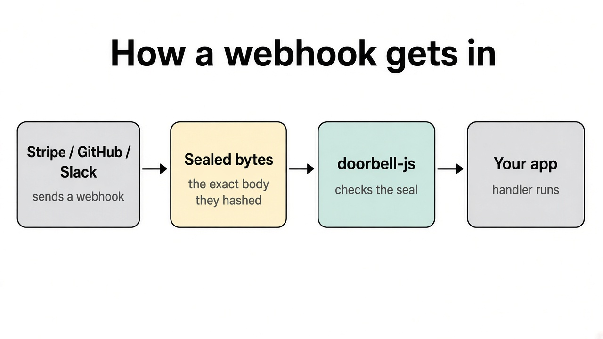
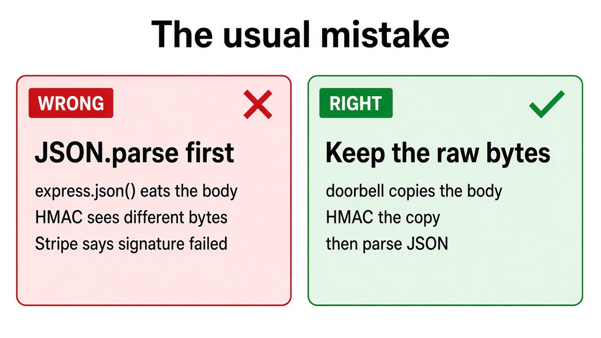
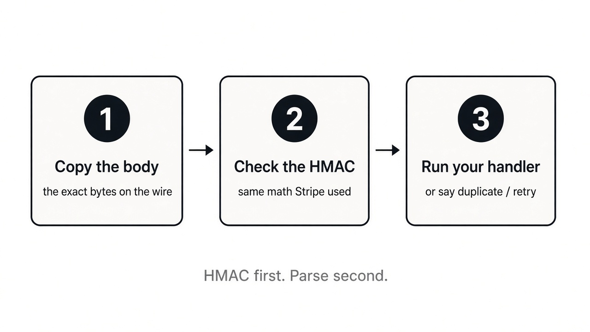

# doorbell-js

When Stripe says “payment succeeded”, or GitHub says “this issue opened”, that message arrives at your server over the public internet. Anyone could POST a fake one.

Those companies lock the message with a shared secret. **doorbell-js checks the lock.** If it still matches, your code runs. If it does not, the request is refused.

For engineers: HMAC over the **raw request body**, not `JSON.parse`, not `JSON.stringify`. Next.js, Express, Fastify, and Hono.

```sh
npm i doorbell-js
```

<p align="center">
  
</p>

Site: [hashim1999164.github.io/doorbell-js](https://hashim1999164.github.io/doorbell-js/) · [FAQ](docs/faq.md) · [Stripe writeup](docs/stripe-webhook-signature-nodejs.md)

## The usual mistake

Most “signature failed” bugs are the same story. The framework reads the body as JSON first. That changes the bytes. The lock was computed on the original bytes, so it no longer fits.

<p align="center">
  
</p>

doorbell copies the body, checks the lock, **then** parses.

<p align="center">
  
</p>

If you already saw this Stripe error, that is almost always the parsed-body problem, or the wrong secret (`sk_live_` instead of `whsec_`):

`No signatures found matching the expected signature for payload`

## Next.js

The export **is** the route. Do not call `req.json()`.

```js
import { doorbell } from 'doorbell-js'

export const POST = doorbell({
  stripe: {
    secret: process.env.STRIPE_WEBHOOK_SECRET,
    on: {
      'checkout.session.completed': async (event) => {
        await fulfill(event.payload)
      },
    },
  },
})
```

## Express

Keep the bytes. `express.json()` is fine for the rest of the app if you use `preserveRawBody` on that parser.

```js
import express from 'express'
import { doorbell, preserveRawBody } from 'doorbell-js'

const app = express()
app.use(express.json({ verify: preserveRawBody }))

const hooks = doorbell({
  github: {
    secret: process.env.GITHUB_WEBHOOK_SECRET,
    on: {
      'issues.opened': async (event) => {
        console.log('issue', event.id)
      },
    },
  },
})

app.post('/webhooks/github', hooks.express)
```

Or give only the webhook route `express.raw({ type: 'application/json' })`. Fastify: `captureFastifyBuffer`. Hono: `hooks.hono`.

## Who it talks to

| Who | What you put in the dashboard |
| --- | --- |
| Stripe | Endpoint signing secret (`whsec_`). Not the API key. |
| GitHub | Webhook **Secret** field. Not a PAT. |
| Slack | Signing Secret. Not `xoxb-`. |
| Shopify | App secret / webhook signing secret. |
| Clerk, Svix, Resend | Standard Webhooks `whsec_` (different math than Stripe). |
| Linear, Paddle, Meta, Twilio | Their webhook / app secret. Twilio also needs the public URL it called. |

Put the name in the path when you take more than one: `/webhooks/stripe`, `/webhooks/github`.

## What happens after a good lock

- Your handler runs once per event. The same Stripe `id` again is a duplicate (200, no second fulfill).
- GitHub and Shopify id headers are not in the HMAC, so retries are keyed on a hash of the body.
- Unknown event types return 200. Stripe retries 5xx, and you do not want a week of `customer.updated`.
- A handler crash returns 500 so the sender retries.

## For engineers

HMAC first, then the clock (same order as stripe-node). Compare digest bytes, not hex strings. A missing header still burns HMAC so that path is not faster.

GitHub and Shopify `event.type` come from the **signed JSON**, not unsigned topic/event headers. Twilio uses `https` unless the host is localhost; set `publicUrl` in production. Express `trust proxy` Host is ignored.

More of the sharp edges (path dots, Origin, gzip, JSON budgets): [CHANGELOG](CHANGELOG.md) and [FAQ](docs/faq.md).

## Tests

```js
import { signStripe } from 'doorbell-js'

const body = '{"id":"evt_test","type":"ping"}'
const header = await signStripe(body, process.env.STRIPE_WEBHOOK_SECRET, Math.floor(Date.now() / 1000))
```

## License

MIT. Hashim Khan. [github.com/Hashim1999164/doorbell-js](https://github.com/Hashim1999164/doorbell-js)
